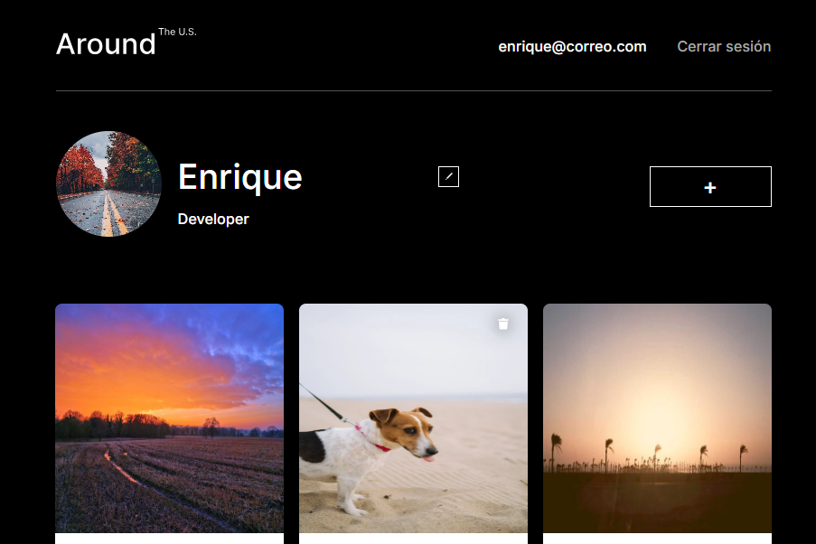
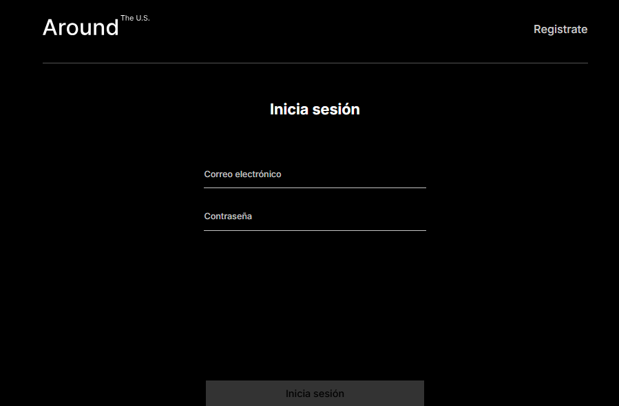

# Tripleten web_project_around_react_auth

Este proyecto fue desarrollado como parte del bootcamp de desarrollo web de Tripleten, utilizando **HTML**, **CSS**, **JavaScript**, **React** y **Vite**. El código fue trabajado en **Visual Studio Code**.

## ¿De qué se trata?

Este proyecto se basa en el proyecto web **web_project_around** disponible en [GitHub de luis-gn006](https://github.com/luis-gn006/web_project_around_react), que fue migrado a **Vite**, un empaquetador moderno diseñado para mejorar la velocidad de desarrollo y optimización en la construcción de aplicaciones web.

## Resoluciones compatibles:

El proyecto está optimizado para las siguientes resoluciones:

1. **1280px** - Desktop
2. **800px** - Tablet
3. **320px** - Mobile

## Vista previa del proyecto:

## Aprendizaje:

En este proyecto se implementaron funcionalidades de **registro**, **autenticación** y **autorización** de usuarios mediante una conexión con una API, junto con el manejo de **localStorage** y el uso de **tokens JWT** para gestionar las sesiones de usuario de manera segura.

## Detalles del código:

El proyecto está estructurado en componentes de **React**. A continuación, se describen las partes más relevantes:

### Estructura de componentes:

- **Login**: Componente encargado de gestionar la conexión con la API para autenticar al usuario, así como almacenar el JWT en el navegador.
- **Register**: Componente que maneja el registro de usuarios a través de la API.
- **InfoTooltip**: Nuevo popup que proporciona información al usuario sobre el estado del registro y login.
- **ProtectedRoute**: Componente que restringe el acceso a las rutas para los usuarios no autenticados.

### Nuevas implementaciones:

- **React Router**: Se implementaron **BrowserRouter**, **Routes**, **Route**, **Navigate** y **useNavigate** para controlar el redireccionamiento de los usuarios según su estado de autenticación y autorización para acceder a las rutas protegidas.

## Link de GitHub Pages para visualizar mi página:

[https://luis-gn006.github.io/web_project_around_auth/](https://luis-gn006.github.io/web_project_around_auth/)

---

# © Luis González

Espero que disfruten de este proyecto tanto como disfruté realizándolo. ¡Saludos!

